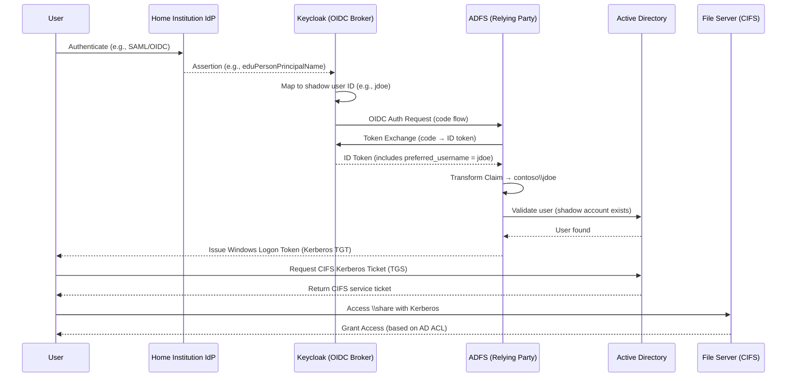

# Federated CIFS Access Using Keycloak and ADFS

## 🔄 Process Description

This flow enables federated users from external institutions to access CIFS shares hosted in Active Directory, using shadow accounts and federated authentication via Keycloak and ADFS.

### 1. **User Authentication via Home Institution IdP**
- The user accesses a portal or service that initiates login via **Keycloak**.
- Keycloak redirects the user to their **home institution IdP** (via SAML or OIDC).
- The user authenticates successfully and returns to Keycloak with an assertion.

### 2. **Keycloak as OIDC Provider**
- Keycloak receives the assertion and maps the identity to a **pre-provisioned shadow account** (e.g., `jdoe`) in the local AD domain.
- Keycloak initiates an **OIDC authorization code flow** with **ADFS**, acting as an OIDC client.

### 3. **ADFS Processes Keycloak Assertion**
- ADFS validates the ID token issued by Keycloak.
- A **claims issuance policy** in ADFS maps a Keycloak claim (e.g., `preferred_username`) to an AD logon identity like `contoso\jdoe`.

### 4. **ADFS Issues Kerberos-Compatible Logon Token**
- ADFS uses the mapped identity to **authenticate the shadow user in Active Directory**.
- If valid, ADFS issues a **Windows logon token** (including a Kerberos TGT).

### 5. **User Accesses CIFS Share**
- The client uses the Kerberos TGT to request a **service ticket for the CIFS file server** from AD.
- The user presents the ticket to the file server (e.g., `\\fileserver\share`).
- The file server verifies the ticket and grants access based on **NTFS/AD group permissions**.

---

## ✅ Pros

- **Standards-based and supported** by Microsoft and Keycloak.
- No need for client-side agents or Kerberos configuration on federated IdP systems.
- **Seamless integration with AD ACLs and CIFS infrastructure** using shadow accounts.
- Fine-grained control through **ADFS claims rules** and **Keycloak role mappings**.
- Enables **auditability and traceability** using AD and ADFS logs.

---

## ❌ Cons

- Requires deploying and maintaining **ADFS**, which is increasingly deprecated in favor of Entra ID.
- Requires **mapping and provisioning shadow accounts** for each federated user.
- Adds complexity: multiple identity systems and trust chains must be coordinated.
- **Single sign-on (SSO)** is not available across unrelated ADFS and home institution environments unless tokens are cached.
- Not scalable for environments with frequent churn in external collaborators unless automated provisioning is in place.
