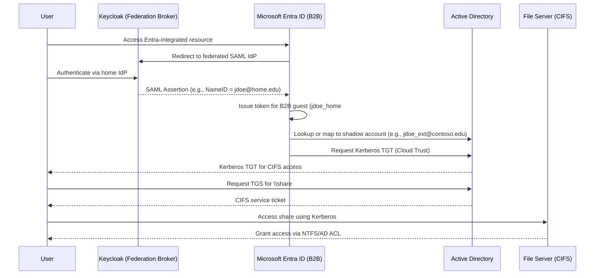

# Federated CIFS Access Using Azure B2B and Keycloak

## Process Description

This configuration uses **Azure AD B2B** (now Entra External ID) to onboard external users via **Keycloak**, which brokers authentication from their home identity providers. These users are represented as **B2B guest accounts** in your Entra tenant. Shadow accounts exist in **Active Directory (AD)** for Kerberos-based access to CIFS shares.

> This model leverages **Azure B2B direct federation** and **Windows Hello for Business Cloud Kerberos Trust** for seamless resource access.

---

## Architecture Components

- **Keycloak**: Brokers federated authentication from external IdPs.
- **Entra ID (Azure AD)**: Primary IdP, with B2B guest users provisioned from Keycloak.
- **Active Directory**: Hosts shadow accounts corresponding to B2B users.
- **Windows File Server**: Hosts CIFS shares secured via AD.
- **Cloud Kerberos Trust or Hybrid Join**: Enables Entra-issued logins to acquire Kerberos tickets from AD.

---

## Authentication Flow

1. External user receives an **Entra B2B invitation** or logs in via a B2B-integrated app.
2. Entra redirects to **Keycloak**, configured as a SAML/WS-Fed direct federation provider.
3. Keycloak authenticates the user and returns a SAML assertion to Entra.
4. Entra recognizes the user as a **B2B guest** and issues a primary Entra token.
5. Entra maps the guest to a **shadow AD account** (e.g., `jdoe_ext@contoso.edu`) via UPN or ImmutableID.
6. With **Kerberos Cloud Trust**, a TGT is issued from **Active Directory** for the shadow account.
7. The user accesses **CIFS shares** with the issued Kerberos ticket.

---

## Pros

- Fully supported and modern Microsoft architecture.
- **No ADFS required**.
- Centralized access policies via Entra Conditional Access.
- Scales well for hundreds or thousands of external collaborators.
- Enables **SSO across Entra-integrated services and legacy CIFS shares**.

---

## Cons

- Requires **shadow account provisioning** in AD with appropriate mapping to guest accounts.
- Guest user lifecycle and access control must be actively managed.
- Requires **Entra Premium P1 or P2** for Cloud Kerberos Trust and Conditional Access.
- Direct federation with Keycloak needs careful claim configuration.

---

