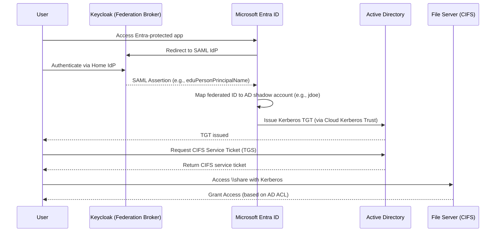

# Federated CIFS Access Using Entra ID and Keycloak (No Azure B2B)

## Process Description

This configuration enables federated users from external institutions to authenticate through **Keycloak**, with **Microsoft Entra ID** serving as the **primary identity provider** to applications and services. Shadow accounts exist in **Active Directory (AD)** for Kerberos-based access to CIFS shares.

> This approach **does not use Azure AD B2B**. Instead, Entra ID directly federates to Keycloak as an external SAML IdP.

---

## Architecture Components

- **Keycloak**: Federates multiple external identity providers.
- **Entra ID**: Accepts SAML assertions from Keycloak and issues primary tokens.
- **Active Directory**: Hosts shadow user accounts and issues Kerberos tickets.
- **Windows File Server**: Provides CIFS shares secured via AD-based Kerberos.
- **Windows Hello for Business (WHfB)** or Cloud Kerberos Trust: Enables cloud-issued logon tokens to access on-prem AD resources.

---

## Authentication Flow

1. User initiates login to a service integrated with **Entra ID**.
2. Entra ID redirects the user to **Keycloak**, configured as a custom **SAML IdP**.
3. Keycloak authenticates the user via their home institution.
4. Keycloak returns a SAML assertion to **Entra ID**, with identity mapped to a shadow user (e.g., `jdoe@contoso.edu`).
5. Entra ID issues a **primary token**, and via **Cloud Kerberos Trust**, the user is issued a **Kerberos ticket** from Active Directory.
6. The user presents the Kerberos ticket to access **CIFS file shares**.

---

## Pros

- Fully supported by Microsoft and Keycloak.
- Eliminates the need for ADFS infrastructure.
- Centralizes federation and authentication in Entra.
- Kerberos ticket issuance is fully compatible with CIFS access.
- Keycloak remains the federation broker across external institutions.

---

## Cons

- Requires Entra ID Premium licensing for WHfB Cloud Kerberos Trust.
- Shadow account provisioning must be well-maintained and secured.
- Direct federation to Entra with non-B2B IdPs is more complex than B2B.
- SSO may be limited unless users' devices are Entra-hybrid or cloud joined.

---

